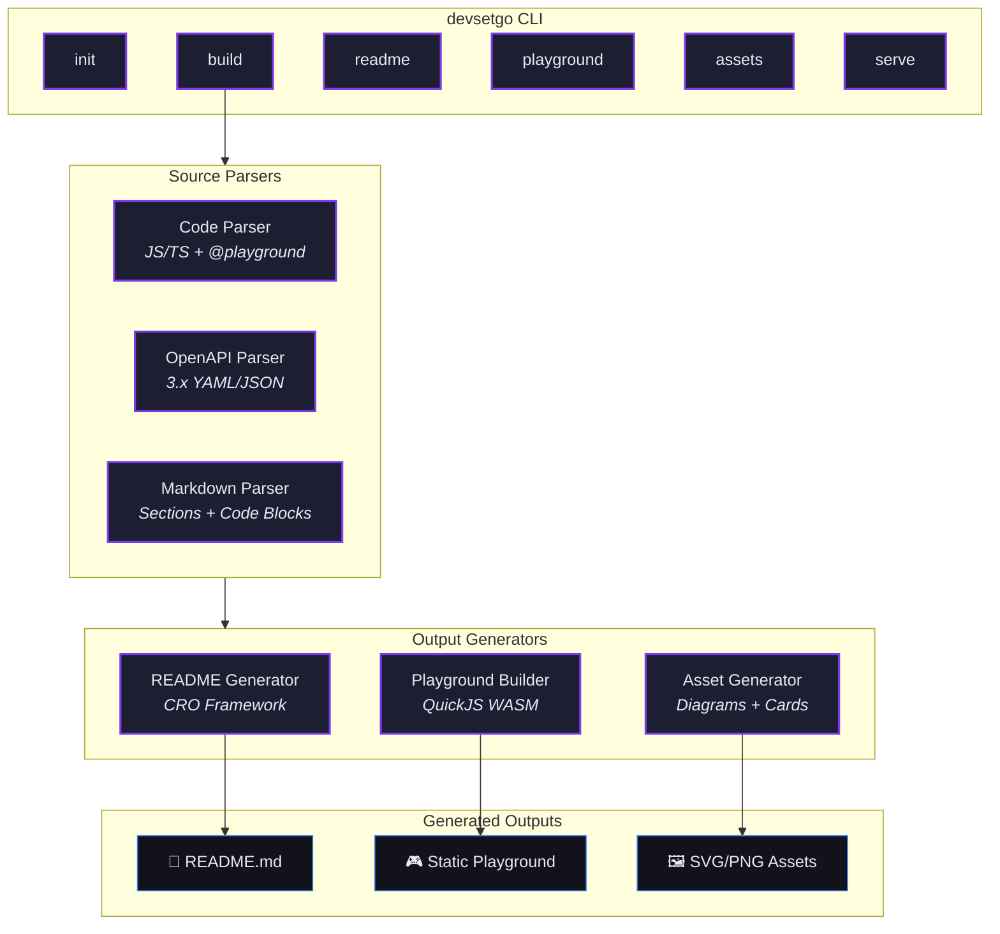

<div align="center">

# devsetgo

### Convert source code into interactive browser playgrounds and conversion-optimized documentation — in one command.


[](https://www.npmjs.com/package/devsetgo)

[](#-interactive-playground)

<br/>

A developer CLI tool and documentation engine that converts source code definitions, OpenAPI schemas, and Markdown files into interactive browser playgrounds and CRO-optimized GitHub documentation pages.

</div>

## 😤 The Problem

Developer tool vendors and B2B software companies frequently struggle to convert GitHub repository visits into technical adoption:

- **README walls of text** — No interactive execution, no visual architecture maps, no clear conversion funnels
- **High onboarding friction** — Developers must clone, install dependencies, and build locally before evaluating anything
- **Zero conversion optimization** — Open-source repos lack structured frameworks to turn visits into enterprise inquiries

## ✨ The Solution

`devsetgo` solves this by compiling your code into **WebAssembly browser modules** and generating **CRO-optimized documentation** — all from a single CLI command.

<div align="center">

<table>
<tr>
<td align="center"><h3>0 sec</h3><sub>Install-to-playground time</sub></td>
<td align="center"><h3>10-section</h3><sub>CRO README framework</sub></td>
<td align="center"><h3>100%</h3><sub>Browser-side execution</sub></td>
</tr>
</table>

</div>

## 🏗️ Architecture



## ⚡ Quick Start

Get up and running in under 30 seconds:

```bash
# Install
npm install -g devsetgo

# Initialize in your project
devsetgo init

# Build everything
devsetgo build
```

## 🎮 Interactive Playground

Try devsetgo directly in your browser — no installation required:

<div align="center">

**[▶ Launch Interactive Playground](#playground)**

<sub>Runs entirely in your browser via WebAssembly. No data leaves your machine.</sub>

</div>

## 📋 Features

| Feature | Status | Description |
|---------|--------|-------------|
| **Code Parser** | ✅ stable | Extracts executable snippets via `@playground` annotations |
| **OpenAPI Parser** | ✅ stable | Parses 3.x schemas into interactive API explorers |
| **Markdown Parser** | ✅ stable | Splits docs into sections, detects executable code blocks |
| **WASM Playground** | ✅ stable | Browser-side JS execution via QuickJS WebAssembly |
| **API Explorer** | ✅ stable | Interactive request builder with auth and cURL export |
| **CRO README** | ✅ stable | 10-section conversion-optimized README generation |
| **Dual CTAs** | ✅ stable | Developer install + enterprise consultation blocks |
| **Architecture Diagrams** | ✅ stable | Auto-generated Mermaid diagrams from code structure |
| **Social Cards** | ✅ stable | Dark-mode OG/Twitter/GitHub cards with SVG/PNG output |
| **Dev Server** | ✅ stable | Local preview with hot-reload |

## 📊 Performance

<div align="center">

| Metric | Value |
|--------|-------|
| Playground Load | **< 2s** (WASM cold start) |
| README Generation | **< 500ms** |
| Asset Generation | **< 3s** (all formats) |
| CLI Startup | **< 200ms** |

</div>

---

<div align="center">

## 🚀 Get Started

<table>
<tr>
<td align="center" width="50%">

### 👩‍💻 Developer Quick Start

**Get Started in 30 Seconds**

```bash
npm install -g devsetgo
```

<sub>Works on macOS, Linux, and Windows. Requires Node.js 20+.</sub>

</td>
<td align="center" width="50%">

### 🏢 Enterprise & Teams

**Book Enterprise Demo**

Custom documentation portals, DX audits, and DevRel growth strategies.

<br/>

<a href="https://calendly.com/devsetgo/discovery">
  
</a>

<br/>
<sub>Custom integrations • SLA support • Dedicated onboarding</sub>

</td>
</tr>
</table>

</div>

---

## 🔧 CLI Commands

| Command | Description |
|---------|-------------|
| `devsetgo init` | Initialize configuration for your project |
| `devsetgo build` | Build everything: playground, README, and assets |
| `devsetgo readme` | Generate a CRO-optimized README only |
| `devsetgo playground` | Generate the interactive browser playground only |
| `devsetgo assets` | Generate architecture diagrams and social cards only |
| `devsetgo serve` | Start a local dev server with hot-reload |

## 🏷️ `@playground` Annotations

Mark code snippets for inclusion in the interactive playground:

```javascript
/**
 * @playground {"title": "Greet Function", "category": "basics", "runnable": true}
 * A simple greeting function.
 */
export function greet(name) {
  return `Hello, ${name}!`;
}
```

## 🤝 Contributing

Contributions are welcome! Please see our [Contributing Guide](CONTRIBUTING.md) for details.

1. Fork the repository
2. Create your feature branch (`git checkout -b feature/amazing-feature`)
3. Commit your changes (`git commit -m 'Add amazing feature'`)
4. Push to the branch (`git push origin feature/amazing-feature`)
5. Open a Pull Request

## 📄 License

This project is licensed under the MIT License — see the [LICENSE](LICENSE) file for details.

---

<div align="center">

**Made with ❤️ by the [devsetgo](https://github.com/abdullahbilal-y/devsetgo) team**

</div>
