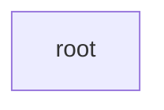

<div align="center">

# devsetgo

### Convert source code into interactive browser playgrounds and CRO-optimized docs — in one command.


[](https://www.npmjs.com/package/devsetgo)

[](https://www.npmjs.com/package/devsetgo)
[](https://github.com/abdullahbilal-y/devsetgo#-interactive-playground)

<br/>

Interactive developer playground and documentation engine — converts source code, OpenAPI schemas, and Markdown into browser playgrounds and CRO-optimized docs.

</div>


## 😤 The Problem

Developer tool vendors and B2B software companies frequently struggle to convert GitHub repository visits into technical adoption:
- README walls of text with no interactive execution or visual architecture maps
- High onboarding friction requiring clone, install, and local build before evaluating anything
- Zero conversion optimization — repos lack structured frameworks to turn visits into enterprise inquiries


## ✨ The Solution

devsetgo solves this by compiling your code into WebAssembly browser modules and generating CRO-optimized documentation — all from a single CLI command.


<div align="center">

<table>
<tr>
<td align="center"><h3>< 2s</h3><sub>Playground Load</sub></td>
<td align="center"><h3>< 500ms</h3><sub>README Generation</sub></td>
<td align="center"><h3>< 3s</h3><sub>Asset Generation</sub></td>
</tr>
</table>

</div>


## 🏗️ Architecture




## ⚡ Quick Start

Get up and running in under 30 seconds:

```bash
# Install
npm install -g devsetgo

# Run
devsetgo init
```


## 🎮 Interactive Playground

Try devsetgo directly in your browser — no installation required:

<div align="center">

**[▶ Launch Interactive Playground](https://github.com/abdullahbilal-y/devsetgo#playground)**

<sub>Runs entirely in your browser via WebAssembly. No data leaves your machine.</sub>

</div>


## 📋 Features

| Feature | Status | Description |
|---------|--------|-------------|
| **Code Parser** | ✅ stable | Extracts executable snippets via @playground annotations |
| **OpenAPI Parser** | ✅ stable | Parses 3.x schemas into interactive API explorers |
| **Markdown Parser** | ✅ stable | Splits docs into sections, detects executable code blocks |
| **WASM Playground** | ✅ stable | Browser-side JS execution via QuickJS WebAssembly |
| **API Explorer** | ✅ stable | Interactive request builder with auth and cURL export |
| **CRO README** | ✅ stable | 10-section conversion-optimized README generation |
| **Architecture Diagrams** | ✅ stable | Auto-generated Mermaid diagrams from code structure |
| **Social Cards** | ✅ stable | Dark-mode OG/Twitter/GitHub cards with SVG/PNG output |
| **Dev Server** | ✅ stable | Local preview with hot-reload |


## 📊 Performance

<div align="center">

| Metric | Value |
|--------|-------|
| Playground Load | **< 2s** |
| README Generation | **< 500ms** |
| Asset Generation | **< 3s** |

</div>


---

<div align="center">

## 🚀 Get Started

<table>
<tr>
<td align="center" width="50%">

### 👩‍💻 Developer Quick Start


**Get Started in 30 Seconds**

```bash
npm install -g devsetgo
```

<sub>Works on macOS, Linux, and Windows. Requires Node.js 20+.</sub>


</td>
<td align="center" width="50%">

### 🏢 Enterprise & Teams


**Book Enterprise Demo**

Custom documentation portals, DX audits, and DevRel growth strategies.

<br/>

<a href="https://calendly.com/devsetgo/discovery">
  
</a>

<br/>
<sub>Custom integrations • SLA support • Dedicated onboarding</sub>


</td>
</tr>
</table>

</div>

---

## 🤝 Contributing

Contributions are welcome! Please see our [Contributing Guide](CONTRIBUTING.md) for details.

1. Fork the repository
2. Create your feature branch (`git checkout -b feature/amazing-feature`)
3. Commit your changes (`git commit -m 'Add amazing feature'`)
4. Push to the branch (`git push origin feature/amazing-feature`)
5. Open a Pull Request

## 📄 License

This project is licensed under the MIT License — see the [LICENSE](LICENSE) file for details.

---

<div align="center">

**Made with ❤️ by the [devsetgo](https://github.com/abdullahbilal-y/devsetgo) team**

</div>


<div align="center">

### Built With

 

</div>
