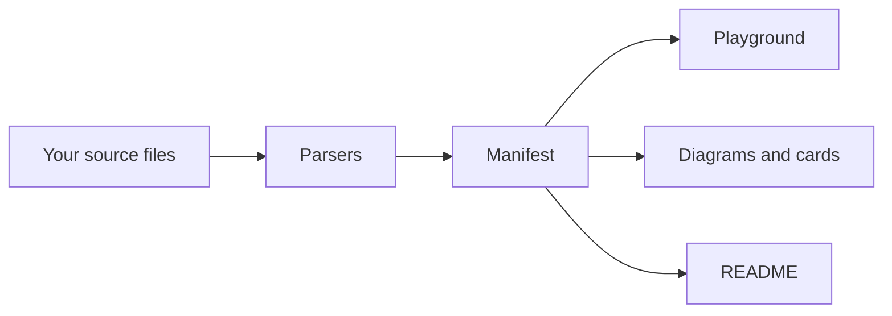

# How devsetgo works

This explains the whole tool from start to finish, in plain language. You should be able to read it without knowing the codebase.

## The short version

devsetgo does three things in order:

1. **Read** your project — find source files, pull out the pieces it needs.
2. **Hold** what it found in one plain object, called the manifest.
3. **Write** output — a web page, some diagrams, a Markdown file.

Nothing in step 3 talks to step 1. Everything passes through the manifest in the middle. That is the whole design.



## Why it is built that way

The alternative would be for each generator to go read the files itself. That fails for two reasons.

The generators would disagree. If the playground counts your examples one way and the README counts them another, the numbers on the page contradict each other and you have no idea which is right.

And it would be untestable. To test the diagram generator you would need a real project on disk. With a manifest in the middle you hand it a plain object and check what comes out. That is why most of the test suite is fast.

## Step 1: Reading the project

Three parsers run, each looking for something different.

### The code parser

Walks your source files looking for a special comment:

```js
/**
 * @playground {"title": "Add two numbers", "runnable": true}
 */
export function add(a, b) {
  console.log(a + b);
}
```

When it finds one, it reads the JSON settings on that line and captures the function below it. That becomes one example.

Opting in with a comment, rather than grabbing every exported function, is deliberate. Most functions in a project make no sense as a standalone demo. You choose which ones do.

### The OpenAPI parser

If your project has an API description file, this reads it and lists every endpoint — method, path, parameters, responses. Those become the API tester tab in the playground.

### The Markdown parser

Splits your existing Markdown into sections by heading and notes which code blocks look runnable.

## Step 2: The manifest

Everything found gets put in one object:

```ts
{
  project:      { name, description, version, repo },
  codeSnippets: [ ... ],   // your annotated examples
  apiEndpoints: [ ... ],   // from the OpenAPI file
  docSections:  [ ... ],   // from Markdown
  modules:      [ ... ],   // folders and what they import
  dependencies: [ ... ],   // from package.json
}
```

That is the only thing the generators ever see.

## Step 3: Writing the output

### The playground

This is the part with the most going on, so here is the full picture.

**Preparing the code.** Each example is transformed before it ever reaches a browser, in [`src/playground/wasm-compiler.ts`](../src/playground/wasm-compiler.ts):

1. **Type annotations are removed** if it is TypeScript, because browsers cannot run TypeScript. This uses the real TypeScript compiler rather than pattern matching. An earlier version used regular expressions and mangled object literals — `{ a: 1 }` looks a lot like a type annotation to a regex.
2. **`export` keywords are removed.** The sandbox has no module system, so `export` there is a syntax error.
3. **A call is added** if the example defines a function and never calls it. Otherwise the visitor clicks Run and nothing happens.
4. **A `console.log` is wrapped** around a trailing bare expression, for the same reason.

Step 3 has a subtlety worth knowing. To decide whether the function is already called, you cannot just search the text for its name — a recursive function like `fib(n - 1)` contains its own name inside its body. The check only counts calls at the start of a line, outside the function.

**Building the page.** The prepared examples get embedded as JSON into a single HTML file, along with all the CSS and JavaScript inline. One file, no build step for the reader.

**Running the code.** This is where WebAssembly comes in, and the name is misleading, so to be precise:

> Your code is **not** compiled to WebAssembly. QuickJS — a small JavaScript engine written in C — is compiled to WebAssembly. That engine runs in the browser and interprets your code.

That is what makes the examples editable. It is a real interpreter running in the page, so a visitor can change the code and run it again with no server involved.

The sandbox gets nothing except a `console` object. No network, no files, no `import`. Code inside it cannot reach the visitor's machine or your servers.

It also runs with a **5-second interrupt**. The engine checks a callback between operations, and once the budget is spent it aborts. Without this, `while (true) {}` in an example would freeze the reader's browser tab with no way out.

### Diagrams

Three Mermaid diagrams, all derived from the manifest:

- **Architecture** — your folders, and arrows for what imports what
- **API flow** — endpoints grouped by tag
- **Dependencies** — your production and development packages

Mermaid is text, and GitHub renders it natively, so these work in a README with no image hosting. Turning them into SVG files is optional and needs an extra tool downloaded on demand — it pulls an entire headless browser, which is far too heavy to require of everyone.

### Social cards

Preview images for when someone pastes your repo link into Slack or Twitter. Built as SVG by hand, then converted to PNG if the `sharp` image library is available. If it is not, the SVG is still written.

### README

Fills a fixed Markdown template from your config file. It arranges text you wrote; it does not write prose.

Every file it generates starts with a marker comment. On the next run, a file **with** that marker is safe to regenerate, and a file **without** one is assumed to be hand-written and is left alone unless you pass `--force`. This is the fix for the worst bug this project has had — version 1 overwrote the README of any project it ran in.

## The dev server

`devsetgo serve` runs a small static file server on `node:http`, no framework.

**Keeping requests inside the folder.** A web server that serves files must never serve a file outside the folder it was pointed at. A request for `../../../etc/passwd` has to be refused. The check resolves the requested path and confirms it sits inside the root.

The obvious version of this check is subtly wrong:

```js
if (!filePath.startsWith(root)) reject(); // not enough
```

If the root is `/site/play`, then `/site/play-secret/creds.env` passes that test — the string does start with the root. The fix is to require the separator too:

```js
if (filePath !== root && !filePath.startsWith(root + sep)) reject();
```

URLs are also decoded first, so an encoded `%2e%2e` is caught, and rejected if they contain a null byte.

**Live reload.** The server injects a small script that asks for the build's timestamp every 1.5 seconds and refreshes the page when it changes. The timestamp is the modification time of `index.html` — an earlier version returned the current time, which is newer on every single check, so the page reloaded forever.

## Where the code lives

```
src/
  cli.ts                 entry point, defines the commands
  commands/              one file per command
  parser/                reading the project
    types.ts             every shared type
  playground/            the web page and browser runtime
  readme/                Markdown generation
  assets/                diagrams and social cards
  utils/                 config, file system, logging
```

Two files are worth pointing out:

**[`src/parser/types.ts`](../src/parser/types.ts)** holds every shared type. The manifest and config shapes live in one place, so a change to either is a change in one file.

**[`src/playground/runtime.ts`](../src/playground/runtime.ts)** is unusual: it is browser JavaScript stored inside a TypeScript template literal, so it can be embedded in the generated page.

That file has a trap. Inside a template literal, `\s` is not a special character — JavaScript collapses it to a plain `s`. A regular expression written as `/^export\s+/` is emitted as `/^exports+/`, which matches nothing, with no error anywhere. Every backslash in that file must be doubled. There is a test that checks the **generated text** rather than the source, because that is the only place the mistake is visible.

## How the tests are organised

| Kind            | What it does                                                         |
| --------------- | -------------------------------------------------------------------- |
| **Unit**        | Calls one function with one input, checks the output. Fast.          |
| **Integration** | Starts a real server on a real port, sends real requests.            |
| **End-to-end**  | Runs the actual command in a temporary folder, checks the exit code. |

The end-to-end tests exist because of a specific lesson. An earlier version had 63 passing tests and shipped a bug that destroyed users' files. Every test called library functions directly, so nothing ever ran the command, and nothing checked what it did to a real directory.

If a tool writes files, a test has to let it write files.
