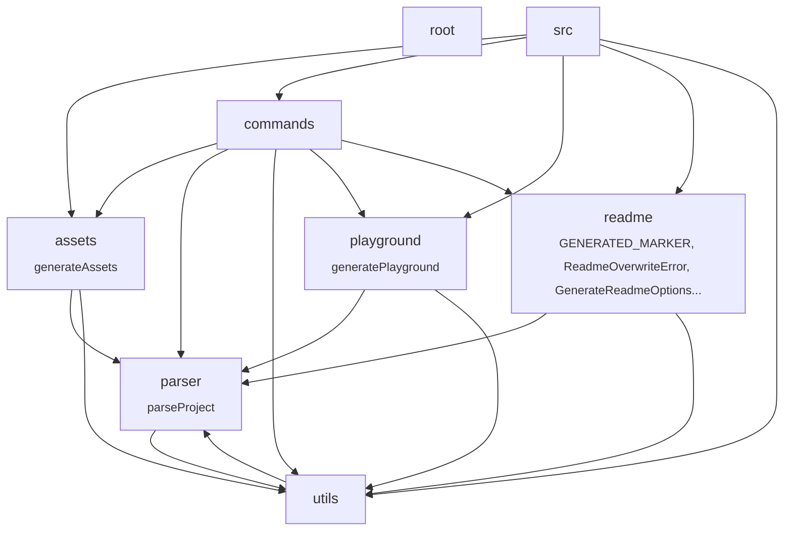

<!-- devsetgo:generated -->
<div align="center">

# devsetgo

### Turn annotated source code into a runnable browser playground and architecture diagrams.


[](https://www.npmjs.com/package/devsetgo)

[](https://www.npmjs.com/package/devsetgo)
[](https://abdullahbilal-y.github.io/devsetgo/)

<br/>

Generates a runnable browser playground and architecture diagrams from your annotated source code.

</div>


## 😤 The Problem

Two parts of a project's documentation go stale the moment anyone merges a pull request:
- Architecture diagrams drawn by hand, which quietly stop matching the real module structure
- Code examples pasted into Markdown, which nobody re-runs and which drift from the working code


## ✨ The Solution

devsetgo reads your source files directly, so both stay correct. It draws the architecture diagram from the imports it actually finds, and turns functions you tag with a comment into examples a reader can edit and run in the browser.


<div align="center">

<table>
<tr>
<td align="center"><h3>169</h3><sub>Tests</sub></td>
<td align="center"><h3>80%</h3><sub>Line Coverage</sub></td>
<td align="center"><h3>6</h3><sub>Runtime Deps</sub></td>
<td align="center"><h3>736 KB</h3><sub>Install Size</sub></td>
</tr>
</table>

</div>


## 🏗️ Architecture




## ⚡ Quick Start

Get up and running in under 30 seconds:

```bash
# Install
npm install -g devsetgo

# Run
devsetgo init
```


## 🎮 Interactive Playground

Try devsetgo directly in your browser — no installation required:

<div align="center">

**[▶ Launch Interactive Playground](https://abdullahbilal-y.github.io/devsetgo/)**

<sub>Runs entirely in your browser via WebAssembly. No data leaves your machine.</sub>

</div>


## 📋 Features

| Feature | Status | Description |
|---------|--------|-------------|
| **Code Parser** | ✅ stable | Finds functions you tagged with a @playground comment |
| **OpenAPI Parser** | ✅ stable | Reads an OpenAPI file and builds a request tester |
| **Markdown Parser** | ✅ stable | Splits Markdown into sections and finds code blocks |
| **WASM Playground** | ✅ stable | Runs your examples in the browser, sandboxed |
| **API Explorer** | ✅ stable | Send real API requests and copy them as cURL |
| **README Generator** | ✅ stable | Fills a Markdown template from your config file |
| **Architecture Diagrams** | ✅ stable | Mermaid diagrams drawn from your real imports |
| **Social Cards** | ✅ stable | Link preview images for social media |
| **Dev Server** | ✅ stable | Local server that reloads when you rebuild |


## 📊 Performance

<div align="center">

| Metric | Value |
|--------|-------|
| Tests | **169** |
| Line Coverage | **80%** |
| Runtime Deps | **6** |
| Install Size | **736 KB** |

</div>


---

<div align="center">

## 🚀 Get Started


**Install**

```bash
npm install -g devsetgo
```

<sub>Works on macOS, Linux, and Windows. Requires Node.js 20+.</sub>


</div>

---

## 🤝 Contributing

Contributions are welcome! Please see our [Contributing Guide](CONTRIBUTING.md) for details.

1. Fork the repository
2. Create your feature branch (`git checkout -b feature/amazing-feature`)
3. Commit your changes (`git commit -m 'Add amazing feature'`)
4. Push to the branch (`git push origin feature/amazing-feature`)
5. Open a Pull Request

## 📄 License

This project is licensed under the MIT License — see the [LICENSE](LICENSE) file for details.

---

<div align="center">

**Made with ❤️ by the [devsetgo](https://github.com/abdullahbilal-y/devsetgo) team**

</div>


<div align="center">

### Built With

  

</div>
